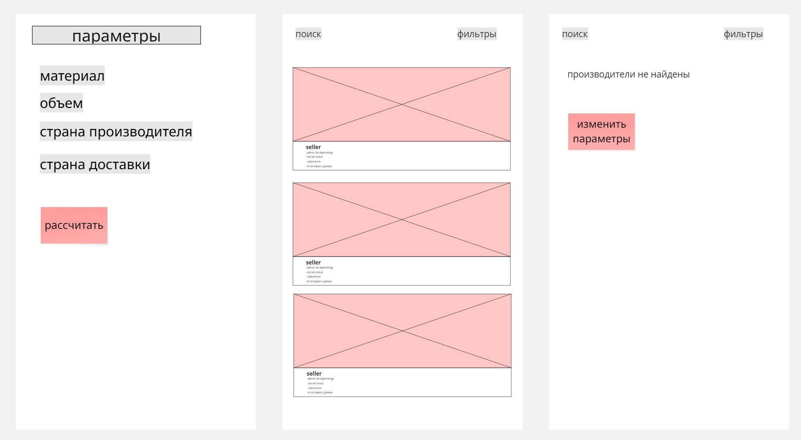

## DDD

### search & calculation
- расчёт полной стоимости сделки
- поиск производителя
- ввести параметры заказа
- фильтрация производителей

глоссарий: запрос, фильтр, материал, страна, срок доставки, логистический тариф, таможенные издержки, MOQ, цена за единицу, итоговая сумма

---

### профиль производителя
- создать профиль
- указать/изменить цену и MOQ
- обновить фото и описание

глоссарий: производитель, профиль, характеристики продукции, цена за единицу, MOQ

---

### заявка на контакт
- оставить заявку на контакт
- получить уведомление о заявке
- статус заявки

глоссарий: заявка, байер, статус, входящий запрос, контакт

---

### вход в систему и роли
- регистрация/авторизация
- указать роль
- сменить пароль
- обновить email
- удалить аккаунт
- верификация пользователей (админ)

глоссарий: байер, производитель, администратор, роль, сессия, аккаунт

---

## BDD

**Критический путь MVP:** байер вводит параметры заказа и получает расчёт стоимости сделки

**Сценарий успеха:**

Дано: байер авторизован в системе, в базе есть верифицированные производители, подходящие под параметры

Когда: он вводит параметры заказа — материал, объём заказа, страна производителя, страна доставки — и нажимает «Рассчитать»

Тогда: система показывает список производителей с разбивкой стоимости по каждому — цена за единицу, логистика, таможня, итоговая сумма

---

**Сценарий отказа:**

Дано: байер авторизован в системе, в базе нет верифицированных производителей, подходящих под параметры

Когда: он вводит параметры заказа — материал, объём заказа, страна производителя, страна доставки — и нажимает «Рассчитать»

Тогда: система показывает сообщение что производители не найдены и предлагает изменить параметры

---

## Wireframes



---

## API-first

### POST /v1/calculation
Байер отправляет параметры заказа, получает список производителей с расчётом.

Input:
```json
{
  "material": "String",
  "volume": "Int",
  "supplier_country": "String",
  "delivery_country": "String"
}
```

Output 200:
```json
{
  "suppliers": [
    {
      "id": "Int",
      "name": "String",
      "price_per_unit": "Float",
      "logistics_cost": "Float",
      "customs_cost": "Float",
      "total_cost": "Float"
    }
  ]
}
```

Output 400:
```json
{
  "error": "Производители не найдены. Измените параметры поиска"
}
```

---

### POST /v1/request
Байер оставляет заявку на контакт с производителем.

Input:
```json
{
  "supplier_id": "Int",
  "buyer_id": "Int",
  "message": "String"
}
```

Output 200:
```json
{
  "request_id": "Int",
  "status": "pending",
  "created_at": "Datetime"
}
```

Output 400:
```json
{
  "error": "Заявка уже отправлена этому производителю"
}
```
