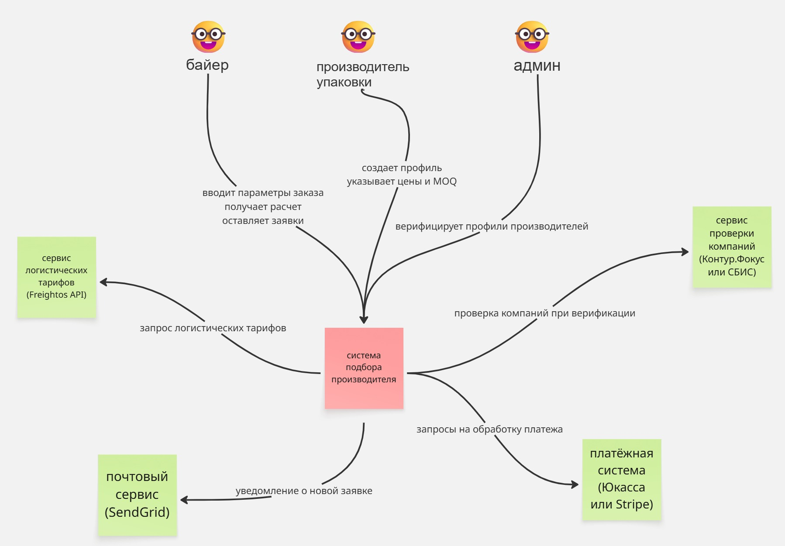
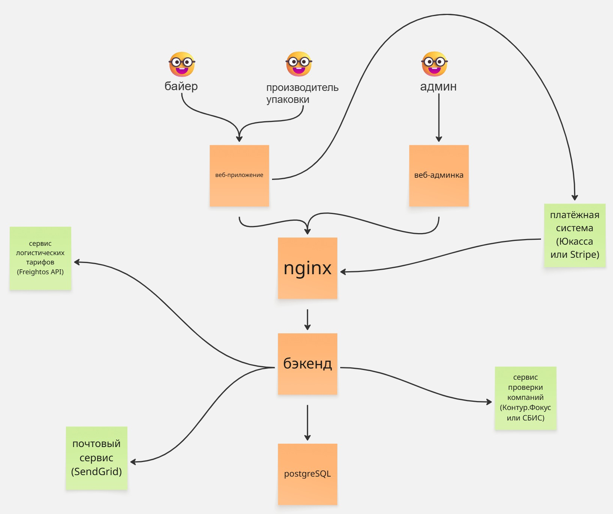

## Схема C4

### Уровень 1 — Контекст

### Уровень 2 — Контейнеры

---

## Стек технологий

- **Фронтенд — React** — подходит для интерактивных форм и таблиц сравнения
- **Бэкенд — Django (Python)** — много функций из коробки, удобен для быстрого старта MVP и интеграции с внешними API
- **База данных — PostgreSQL** — хорошо держит сложные запросы с фильтрацией по нескольким параметрам
- **Хранение медиа — Yandex Object Storage** — хранение фото продукции производителей
- **Веб-сервер — nginx** — балансировка и проксирование запросов
- **Деплой — Yandex Cloud** — российская инфраструктура, актуально для рынка РФ
- **Платежи — Юкасса** — обработка платежей по подписке
- **Почта — SendGrid** — отправка email-уведомлений о заявках и верификации
